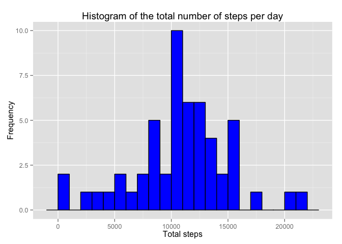
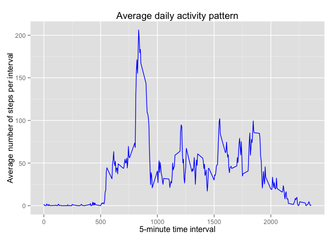
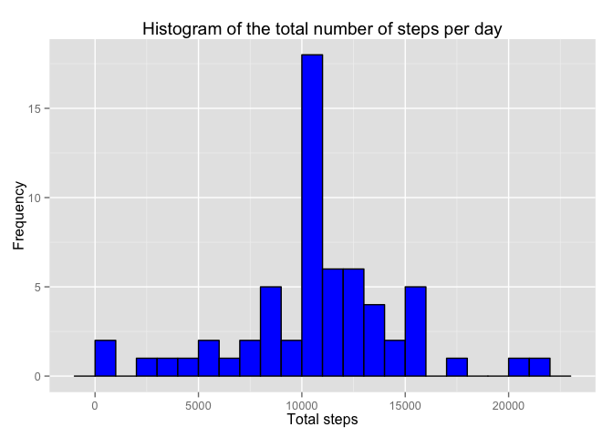
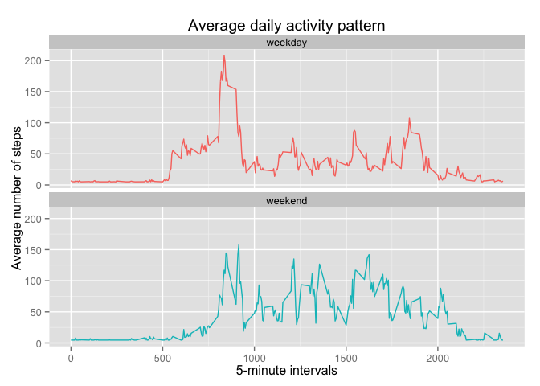

# Reproducible Research - Peer Assessment 1
G. S  
8 May 2015  

# Introduction:
It is now possible to collect a large amount of data about personal movement
using activity monitoring devices such as a Fitbit, Nike Fuelband, or Jawbone Up.
These type of devices are part of the “quantified self” movement – a group of
enthusiasts who take measurements about themselves regularly to improve their
health, to find patterns in their behavior, or because they are tech geeks.
But these data remain under-utilized both because the raw data are hard to
obtain and there is a lack of statistical methods and software for processing
and interpreting the data.

This assignment makes use of data from a personal activity monitoring device.
This device collects data at 5 minute intervals through out the day.
The data consists of two months of data from an anonymous individual collected
during the months of October and November, 2012 and include the number of steps
taken in 5 minute intervals each day.


Data:

<https://d396qusza40orc.cloudfront.net/repdata%2Fdata%2Factivity.zip>

The variables included in this dataset are:

* steps: Number of steps taking in a 5-minute interval (missing values are coded as NA)

* date: The date on which the measurement was taken in YYYY-MM-DD format

* interval: Identifier for the 5-minute interval in which measurement was taken

The dataset is stored in a comma-separated-value (CSV) file and there are a total of 17,568 observations in this dataset.


Library required for the assignment:


```r
library(data.table)
library(dplyr)
```

```
## 
## Attaching package: 'dplyr'
## 
## The following objects are masked from 'package:data.table':
## 
##     between, last
## 
## The following object is masked from 'package:stats':
## 
##     filter
## 
## The following objects are masked from 'package:base':
## 
##     intersect, setdiff, setequal, union
```

```r
library(ggplot2)
```

```
## Warning: package 'ggplot2' was built under R version 3.1.3
```

```r
library(knitr)
```


# Assignment


```r
opts_chunk$set(echo = TRUE)
```


## Loading and preprocessing the data


```r
setwd("~/Desktop/Coursera/Exploratory_Data_Analysis/Assignment_1")
Data_Activity <- read.csv("./activity.csv",
                          header = TRUE,
                          sep = ',',
                          colClasses = c("numeric", "Date","integer"))

summary(Data_Activity)
```

```
##      steps             date               interval     
##  Min.   :  0.00   Min.   :2012-10-01   Min.   :   0.0  
##  1st Qu.:  0.00   1st Qu.:2012-10-16   1st Qu.: 588.8  
##  Median :  0.00   Median :2012-10-31   Median :1177.5  
##  Mean   : 37.38   Mean   :2012-10-31   Mean   :1177.5  
##  3rd Qu.: 12.00   3rd Qu.:2012-11-15   3rd Qu.:1766.2  
##  Max.   :806.00   Max.   :2012-11-30   Max.   :2355.0  
##  NA's   :2304
```


## What is mean total number of steps taken per day?
**For this part of the assignment, the missing values in the dataset are ignored.**

1- Calculate the total number of steps taken per day:


```r
Total_Steps_Per_Day <- Data_Activity %>%
        filter(!is.na(steps)) %>%
        group_by(date) %>%
        summarize(Total_Steps = sum(steps, na.rm = TRUE))

head(Total_Steps_Per_Day)
```

```
## Source: local data frame [6 x 2]
## 
##         date Total_Steps
## 1 2012-10-02         126
## 2 2012-10-03       11352
## 3 2012-10-04       12116
## 4 2012-10-05       13294
## 5 2012-10-06       15420
## 6 2012-10-07       11015
```

2- Make a histogram of the total number of steps taken each day:


```r
ggplot(Total_Steps_Per_Day, aes(x = Total_Steps))+
        geom_histogram(fill = "blue", colour = "black", binwidth = 1000) +
        labs(title = "Histogram of the total number of steps per day",
             x = "Total steps", y = "Frequency")
```

 

3- Calculate and report the mean and median of the total number of steps taken per day:


```r
Total_Steps_Per_Day_Mean <- mean(Total_Steps_Per_Day$Total_Steps)
Total_Steps_Per_Day_Median <- median(Total_Steps_Per_Day$Total_Steps)
```

*The total number of steps taken per day mean is: 1.0766189\times 10^{4}.*
*The total number of steps taken per day median is: 1.0765\times 10^{4}.*


## What is the average daily activity pattern?

1- Make a time series plot of the 5-minute interval and the average number
of steps taken, averaged across all days:


```r
Data_Activity_Pattern <- Data_Activity %>%
        group_by(interval) %>%
        summarize(Total_Steps = sum(steps, na.rm = TRUE),
                  Average_Steps = mean(steps, na.rm = TRUE)) 

ggplot(Data_Activity_Pattern, aes(x=interval, y=Average_Steps))+
        geom_line(color = "blue")+
        labs(title = "Average daily activity pattern",
             x = "5-minute time interval", y = "Average number of steps per interval")
```

 

2- Which 5-minute interval, on average across all the days in the dataset, 
contains the maximum number of steps?


```r
Max_Interval <- which.max(Data_Activity_Pattern$Total_Steps)
MaximumInterval <- Data_Activity_Pattern[Max_Interval,"interval"]
```

*The maximum number of steps is contained in the 835th interval.*


## Imputing missing values
Note that there are a number of days/intervals where there are missing values (coded as NA). 
The presence of missing days may introduce bias into some calculations or summaries of the data.

1- Calculate and report the total number of missing values in the dataset:


```r
Total_Missing_Data <- sum(is.na(Data_Activity))
```

*The total number of missing values is 2304.*

2- Devise a strategy for filling in all of the missing values in the dataset.


```r
Data_Activity_Mean_Replace_NA <- Data_Activity %>%
        mutate(steps = replace(steps, is.na(steps), mean(steps, na.rm=TRUE)))

head(Data_Activity_Mean_Replace_NA)
```

```
##     steps       date interval
## 1 37.3826 2012-10-01        0
## 2 37.3826 2012-10-01        5
## 3 37.3826 2012-10-01       10
## 4 37.3826 2012-10-01       15
## 5 37.3826 2012-10-01       20
## 6 37.3826 2012-10-01       25
```

3- Create a new dataset that is equal to the original dataset but with the
missing data filled in.


```r
Data_Activity_II <- Data_Activity_Mean_Replace_NA %>%
        group_by(date) %>%
        summarize(Total_Steps = sum(steps, na.rm=TRUE))
```

4- Make a histogram of the total number of steps taken each day and
Calculate and report the mean and median total number of steps taken per day.


```r
ggplot(Data_Activity_II, aes(x = Total_Steps)) +
        geom_histogram(fill = "blue", colour = "black", binwidth = 1000) +
        labs(title = "Histogram of the total number of steps per day",
             x = "Total steps", y = "Frequency")
```

 

```r
Total_Steps_Per_Day_Mean2 <- mean(Data_Activity_II$Total_Steps)
Total_Steps_Per_Day_Median2 <- median(Data_Activity_II$Total_Steps)
```

*The total number of steps taken per day mean is now: 1.0766189\times 10^{4}.*
*The total number of steps taken per day median is now: 1.0766189\times 10^{4}.*

```
**Do these values differ from the estimates from the first part of the assignment?**

* Previous Mean: 1.0766189\times 10^{4} vs Mean with NA: 1.0766189\times 10^{4}.
* Previous Median: 1.0765\times 10^{4} vs Median with NA: 1.0766189\times 10^{4}.


**What is the impact of imputing missing data on the estimates of the total daily number of steps?**

* The mean and the median are now equal.


## Are there differences in activity patterns between weekdays and weekends?

1- Create a new factor variable in the dataset with two levels – “weekday” 
and “weekend” indicating whether a given date is a weekday or weekend day.


```r
Data_Activity_Weekdays <- mutate(Data_Activity_Mean_Replace_NA,
                                 day = weekdays(Data_Activity_Mean_Replace_NA$date))

Data_Activity_Weekdays <- mutate(Data_Activity_Weekdays,Weekday_Weekend = ifelse(weekdays(Data_Activity_Weekdays$date)=="Sunday" | weekdays(Data_Activity_Weekdays$date)=="Saturday","weekend", "weekday"))

Data_Activity_Weekdays <- Data_Activity_Weekdays %>%
        group_by(Weekday_Weekend, interval) %>%
        summarise(Mean_Steps = mean(steps))
```

2- Make a panel plot containing a time series plot of the 5-minute interval (x-axis)
and the average number of steps taken, averaged across all weekday days or weekend days (y-axis).


```r
ggplot(Data_Activity_Weekdays, aes(x=interval, y=Mean_Steps, color = Weekday_Weekend)) +
        geom_line() +
        facet_wrap(~Weekday_Weekend, ncol = 1, nrow=2)+
        labs(title = "Average daily activity pattern",
             x = "5-minute intervals", y = "Average number of steps")+
        theme(legend.position="none")
```

 
